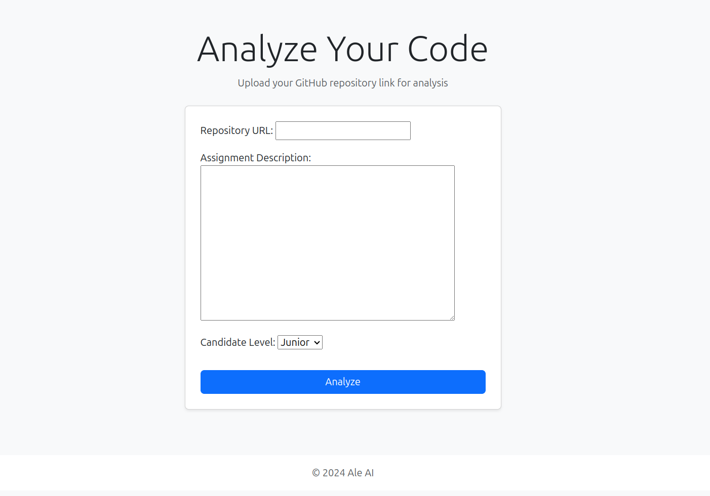

# AI Code Review on Django

## Installation and launch

1. Clone repositories:

   With HTTP
   ```bash
   git clone https://github.com/k0drin/AI-Code-Review.git
   ```

   With SSH
   ```bash
   git clone git@github.com:k0drin/AI-Code-Review.git
   ```
2. Install the virtual environment and activate it:
   ```bash
    python3 -m venv venv
    source venv/bin/activate  # For Windows, use `venv\Scripts\activate`
    ```
3. Install all dependencies:
   ```bash
    pip install -r requirements.txt
    ```
4. Perform migrations:
   ```bash
    python manage.py migrate
    ```

5. Start the development server:
   ```bash
    daphne code_analyzer.asgi:application
    ```
8. Now just open it in your browser this address `http://127.0.0.1:8000/` and fill in the fields

   
   


